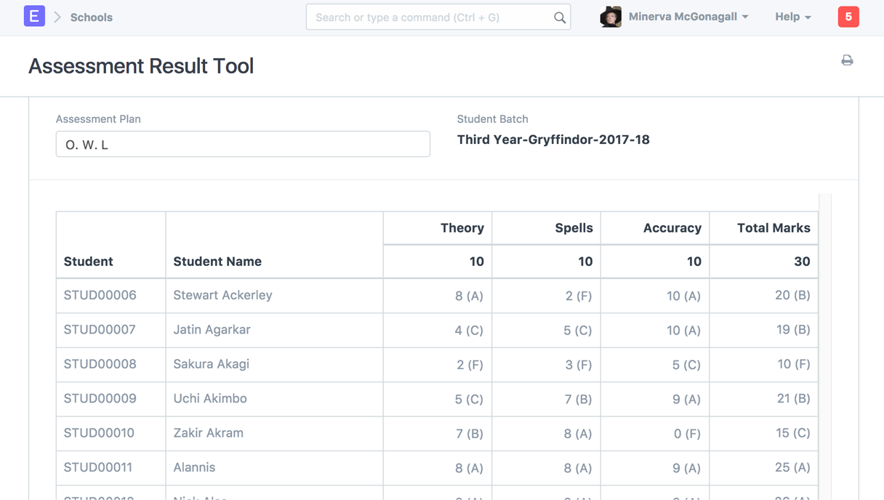

# Introduction

**The Education domain is designed to meet requirements of any organization which imparts knowledge and believe in doing so in an organized fashion. It has already been used at schools, colleges and even in private firms.**

It helps you to effectively manage administration and allows you to focus on what is most important for your institute, to educate!

**Contents of Education Domain**

Using Education module , you can effectively manage operations like:

- _Managing Student_
- _Program and Courses_
- _Publishing Programs on the portal_
- _Online Admissions_
- _Student Attendance_
- _Course Scheduling_
- _Portal for Publishing Programs_
- _Assessment Planning and Assessment Result_
- _Fee Structure and Fee Receipt_

<!--  -->
