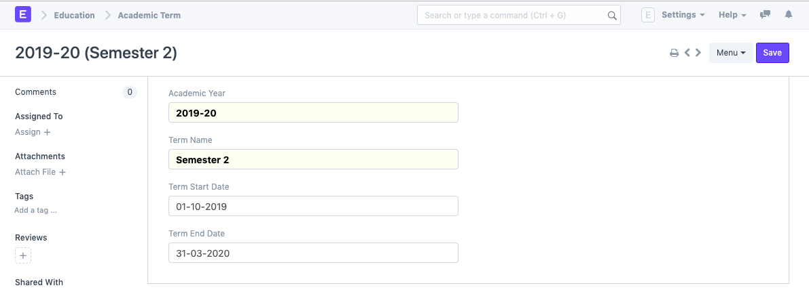
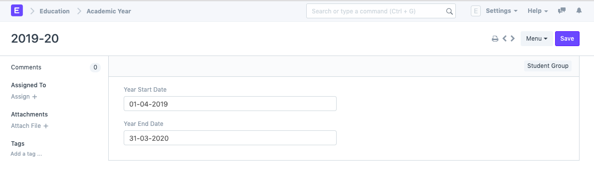

# Academic Year

**An academic year is a period which the Educational Institutes, Schools and Universities use to measure a quantity of study.**

The **Academic year** form have the Start and End date for the Academic year.

Within an Academic Year, you can have multiple **Academic Terms**.

An academic Year can be further liked to a Student group, which can be created from an Academic Year.

If the Academic Year has been specified in the Education Settings then it will become the default Academic Term in all the forms and will be editable if required.

The following are the various forms where Academic Year is a relevant field:

1. Student Log
2. Student Group
3. Student Applicant
4. Student Admission
5. Program Enrollment
6. Assessment Plan
7. Assessment Result
8. Assessment Criteria
9. Fees
10. Fee Schedule
11. Fee Structure
12. Fee Category
13. Course Schedule
