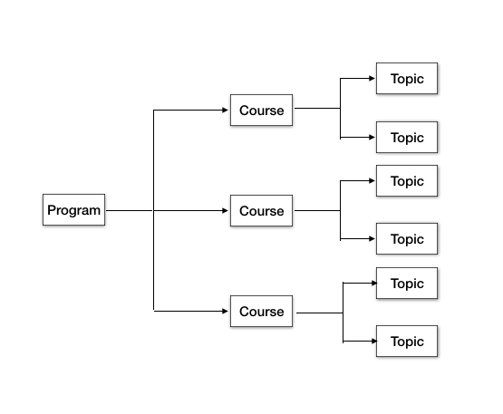
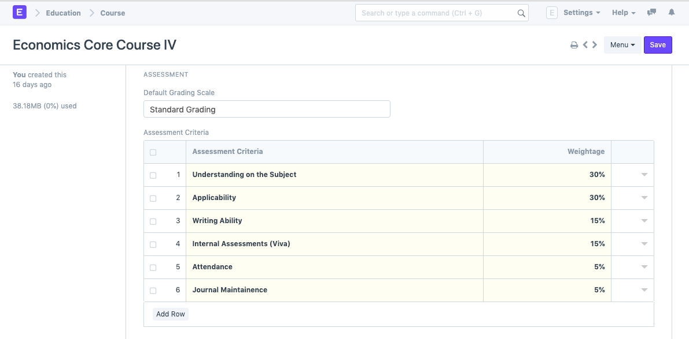

# Course

**A course can be considered as a subject or a part of an educational program which is to be taught for a term.**

For example, if for a particular term, Economics Major is a program taught in the institute, then Mathematical Methods for Economics would be a Course covered under the program.

A course will have a set of topics that are to be covered under it's scope.

To access the course list, go to:

`Home > Education > Masters > Course`

**1. Prerequisites**

Before creating a course, it is advised to create:

1. Department
2. Topics

**2. How to create a course**

1. Go to Course List and click on New.
2. Enter the Course Name.
3. Select the Department under which this course is being made.
4. Add the Topics. You can also create the topics from here itself.
5. Add the Description for the course.
6. Save.

**3. Features**

**3.1. Assessment**

For every new Course a User can have a New Assessment setting where in they can define the criteria based on which the students will be assessed for the course.

1. Default Grading Scale: A default Grading Scale can be set up for the course, wherein you can define what would be the achievement level of the student based on the scores they earn for a course.
2. Assessment Criteria: You can define the Assessment Criteria for this course wherein based on the different parameters of assessment, the student's understanding of the subject would be assessed.

**4. More Actions**

Once the course has been created, the following documents can be created from the course, which will later be linked to the course.

1. Program
2. Student Group
3. Course Schedule
4. Assessment Plan
