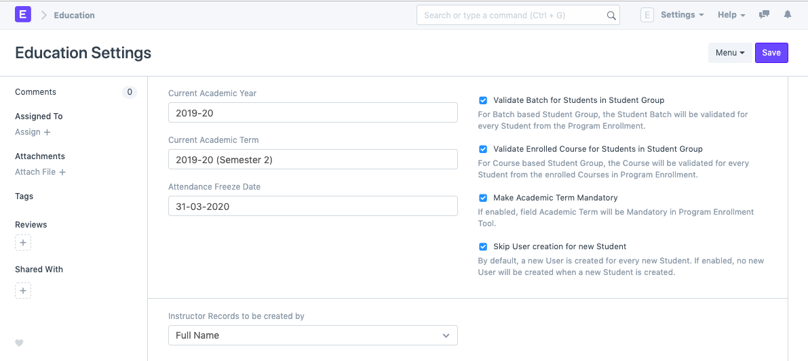

# Education Settings

**The Education Settings will allow you to do a basic setup for your Institute wherein you can define the Academic Year, Academic Term, and other defaults for your ERPNext account.**

These configuration settings will have an impact throughout the module.

To access Academic term, go to:

`Home > Education > Settings > Education Settings`

**1. Steps to configure Education Settings**

1.  Select the current Academic Year. This will become the default Academic Year throughout your account.
2.  Select the current Academic Term. This will become the default Academic Term throughout your account.
3.  Select the Attendance Freeze date. Any attendance captured after the Attendance Freeze Date would not be valid.
4.  Select how you want the Instructor Records to be created, using Full Name, using Naming series or using Employee Number.
5.  **Instructor Record to be created by:** You can select how you want the Instructor Records to be created in your ERPNext system, whether it should be by Full Name, by Naming series, or by Employee Code.

**1.1. Configuring Properties**

- **Validate Batch for Students in Student Group:** When adding students to a student group via Batch, the system will verify whether the student belongs to that batch or no, and if the same has not happened, an error will be shown while saving the Student Group.
- **Validate Batch for Students in Student Group:** When adding students to a student group via Course, the system will verify whether the student is enrolled to that course or no, and if the same has not happened, an error will be shown while saving the Student Group.
- **Make Academic Term Mandatory:** When enabled, this option will ensure that while creating a Program Enrollment via the Program Enrollment Tool, the user has to enter the Academic Term.
- **Skip User Creation for New Student:** Whenever a new student is created, by default a User is created against it. If this option is enabled, no new User will be created when a new Student is created.
