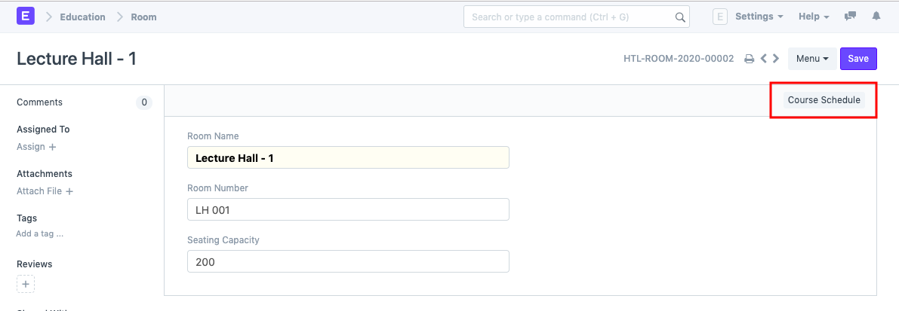

# Room

**Room refers to a tutoring space which can be set as the venue for courses or examinations.**

Examples of a room are Examination Halls, Classrooms, or Labs. The Room will have details like Room number and Room Capacity.

To access Room, go to:

`Home > Education > Masters > Room`

**1. How to create a Room**

1. Go to the Room list and click on New.
2. Add the name of the room.
3. Add the Room Number for the selected room.
4. Enter the Seating capacity for the room.

**2. Other Actions**

A Room can be further linked to a Course Schedule.

