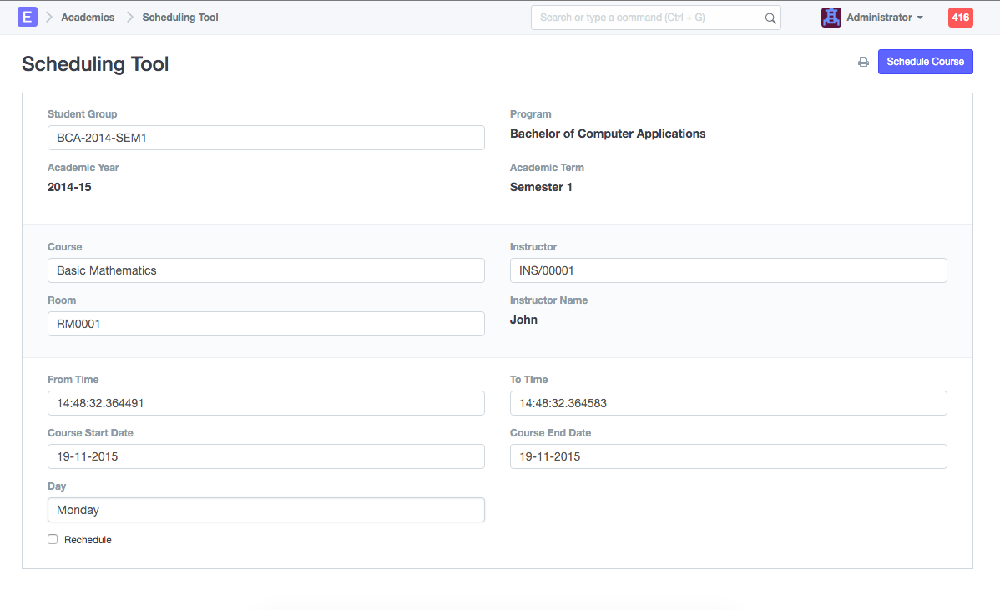

# Course Scheduling Tool

This tool can be used to create 'Course Schedules'.

**1. Creating Course Schedules**

1.  Select Student Group for which you need to create Course Schedules.
2.  Select Course, Room and Instructor for Course Schedules.
3.  Enter From Time and To Time for Course Schedule.
4.  Enter Start Date and End Date of the Course (Course Schedules will be created within this date range)
5.  Enter Day of the week on which you want to schedule the Course.
6.  Click on the 'Schedule Course' button
7.  The system will create Course Schedules if the Room and Instructor are available and there is no conflict for the selected Student Group with other Course Schedules.

**2. Rescheduling**

1.  If you wish to reschedule Course Schedules created against a Course, follow the instructions for creating course schedules
2.  Check the 'Reschedule' checkbox and then click 'Schedule Course' button.
3.  System will delete existing Course Schedules for specified Course within the mentioned Course Start Date and Course End Date and crate new Course Schedules.
