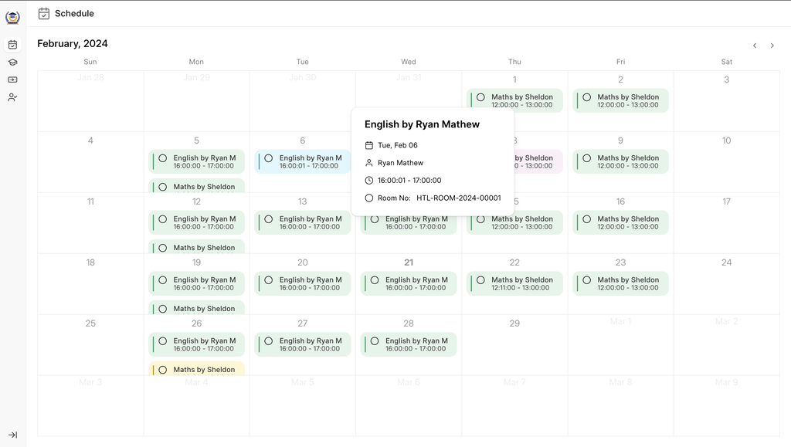
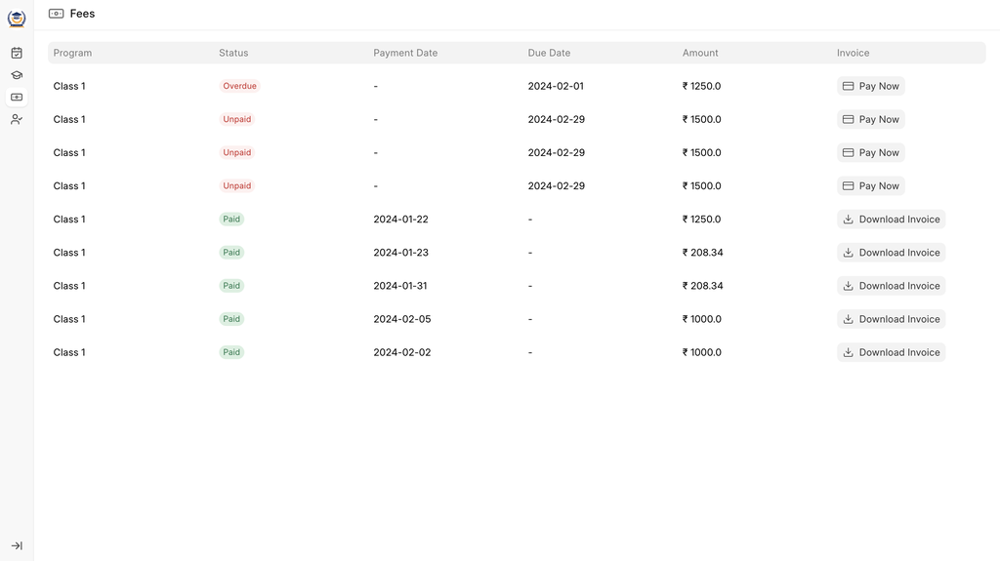

# Student Portal

**Features with the portal:**

1. School/College Timetable
2. Current and Previous Grades
3. Fee History and Fee Payment
4. Student Attendance
5. Student Profile Data
6. Timetable

All the courses which are scheduled for the particular program for that particular student will be displayed on the "/education/schedule" page. The data of the same is taken from the "Course Schedule" DocType

Whatever color the user will decide in the Course Schedule DocType, will be displayed in the Calendar.

On clicking each class, student will be able to see data related to the class.

**Grades**

On this page the Student can check the results of the examination conducted in the current Program, or from the Drop down list student can select previous programs and see the grades for the each exam conducted in that program.

The data in this page is taken from "Assessment Result" DocType. Then the data is grouped together to show the results in the format shown in the image.

**Fees**

On this page student can either check the previous payments or they can pay any fees if there is any.

For already "Paid" Fees, the student can download the Invoice and whatever is the "Standard Print Format" is in "Sales Invoice" doctype, will be shown to the student. The data on this Page is taken from the Sales Invoice DocType

If the student wants to pay the Fees, then on Clicking "Pay Now", a razorpay payment gateway is opened.

To setup Razorpay, go to Education Settings -> Portal Settings, and enter your "Razorpay Key" & "Razorpay Secret".

On successful payment, a Payment Entry is created against that Fees (which basically is a Sales Invoice), and the status of the payment is then updated to "Paid" in that particular "Sales Invoice", which is then reflected in the frontend.

**Attendance**

Attendance data for current Program and any Student Groups is displayed over here, as a student can be enrolled in various Student Groups so all the Student Groups are visible in the dropdown.

On clicking of any Student Group the Present and Absent Data is shown in the calendar. The data for this page is taken from "Student Attendance" DocType.

A student can also apply for leave here from the attendance page by clicking on "Apply for Leave" button. A dialog is popped up.

Based on Education Settings (Portal Tab), the attendance is marked for the student.

If "Attendance Based on Course Schedule" is enabled, the attendance will be marked on Course Schedule basis and will be mandatory. If disabled, the attendance will be marked on Student Group Basis for that particular date.

The use case for the above is:

Some schools like to take attendance at the starting of the day and some schools take attendance for each class, so depending upon your use case you can change the education settings.

**Student Profile Data**

After clicking on the School Logo, the student can see their profile data. The profile data is taken from the Student Master.
